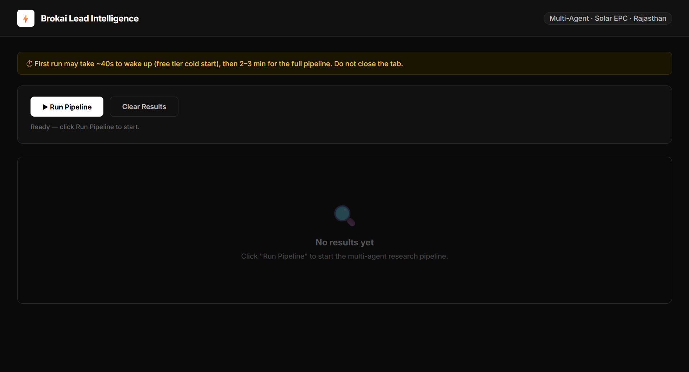
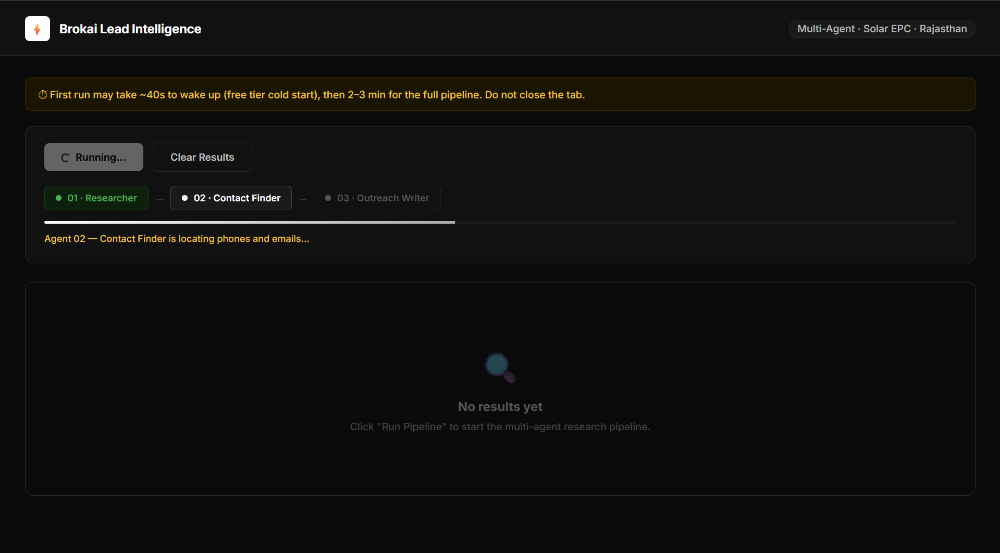

# Brokai Lead Intelligence System
<br>
<p align="center">
  
  &nbsp;
  
  &nbsp;
  
  &nbsp;
  
</p>

An automated lead intelligence system that researches businesses, finds publicly available contact information, and generates personalized WhatsApp outreach - built to handle real-world API constraints and data quality issues.
<br><br>

## 🌐 Live Demo

<p align="center">
  <a href="https://brokai-assessment.onrender.com/">
  
  &nbsp;
  <a href="https://brokai-assessment.onrender.com/">
    
  </a>
</p>

<p align="center">
  <sub>  ⚠️ Cold start: ~30–50s • Full run: ~3-5 min. Do not close the tab.</sub>
</p>

---
## 💡 Problem This Solves

Manual lead research is slow and inconsistent. Sales teams spend hours:
- Googling company backgrounds and verifying information
- Hunting for contact info across multiple directories
- Writing personalized outreach messages from scratch

This system automates the entire workflow - research, contact discovery, and message generation - reducing hours of manual work to minutes while maintaining output quality and personalization.

---

## Dashboard Screenshots :


<br><br>


---

## Architecture diagram :


---

## What It Does :

Three specialised agents work in sequence for each company:

| Agent | Role | Input | Output |
|-------|------|-------|--------|
| **01 - Researcher** | Searches the web to build a business profile | Company name + location | Summary, digital presence, CRM usage |
| **02 - Contact Finder** | Locates phone, email, WhatsApp from directories | Business profile | Contact card with source URL |
| **03 - Outreach Writer** | Generates a personalised WhatsApp-style cold message | Profile + contact card | Ready-to-send message |
<br>

**Batch parallel processing:** 3 companies/batch via asyncio.gather() with 3s inter-batch delay - completes 21 companies in ~2-3min instead of 7-9min sequential, without hitting free tier rate limits.

---
## 🧪 How It Works (Demo Flow)

1. Click "Run Pipeline"
2. Processes companies in batches of 3
3. Each row updates with profile, contact, and outreach
4. Full results appear in ~3-5 minutes

---

## ⚡ Engineering Highlights

- **Rate-limit resilient**: Exponential backoff retry (1s→2s→4s) + batch processing to handle Groq's 12K TPM limit
- **Batch parallel execution**: 3 companies/batch with 3s pauses → 2-3min runtime vs 7-9min sequential
- **Multi-account routing**: Split Groq accounts by task type (extraction vs writing) to avoid quota bottlenecks
- **Graceful failure**: Pipeline never crashes — fallback values at every error point
- **Async orchestration**: `asyncio.to_thread()` wrapping for sync API calls in async context

---

## Actual Output (from live run) :
```json
{
  "company": "Yash Electricals & Civil Services",
  "location": "Rajasthan, India",
  "contact_phone": "Not found",
  "contact_email": "yashelectricals2016@gmail.com",
  "digital_presence": "website, social media, directory listings (IndiaMART, Justdial, ENF Solar, Facebook)",
  "outreach_message": "Hi Yash Electricals & Civil Services, I came across your solar installation services in Jaipur and noticed you must handle a high volume of customer calls and follow-ups manually. Our AI-powered voice receptionists can help you automate calls, reducing response times by up to 50% and freeing up staff to focus on installations. Would you be open to a quick chat about how this could work for your business?"

Note: Output is generated from live model responses with minimal post-processing. Quality varies depending on available public data.
}
```
---

## Stack

- **Backend:** FastAPI (Python)
- **LLM:** Groq (Llama 3.1 8B Instant) - two accounts, split by task type
- **Web Search:** Tavily
- **Frontend:** Vanilla HTML/CSS/JS
- **Deployment:** Render (free tier)

---
## Project Structure
```
BROKAI_ASSESSMENT
├── agents/
│ ├── contact_finder.py
│ ├── llm_client.py
│ ├── outreach_writer.py
│ └── researcher.py
├── assets/
│ ├── architecture.png
│ ├── dashboard1.png
│ └── dashboard2.png
├── static/
│ └── index.html
├── .env.example
├── main.py
├── render.yaml
├── requirements.txt
└── README.md
```
---


## Run Locally :

**1. Clone the repo**
```bash
git clone https://github.com/sohamrajput98/brokai-assessment.git
cd brokai-assessment
```

**2. Set up virtual environment**
```bash
python -m venv venv
source venv/bin/activate  # Windows: venv\Scripts\activate
pip install -r requirements.txt
```

**3. Add your API keys**
```bash
cp .env.example .env
# Edit .env and fill in your keys
```

**4. Add the companies Excel file (optional)**
```bash
mkdir data
# Copy companies.xlsx into data/ if you have it
# Without it, the pipeline runs on the hardcoded company list
```

**5. Run the server**
```bash
uvicorn main:app --reload
```

Visit `http://localhost:8000` and click **Run Pipeline**.

---
## 🎯 Assessment Alignment

- ✅ **Clear agent separation** — 3 independent modules with defined input/output contracts
- ✅ **Graceful failure handling** — Retry logic, fallback values, no pipeline crashes
- ✅ **Production deployment** — Live on Render with public URL
- ✅ **Real-world constraints** — Rate limit handling, free tier optimization
- ✅ **Code quality** — Modular structure, minimal abstraction, readable

---

## Environment Variables :

```
GROQ_API_KEY_1=gsk_...      # Groq account 1 — researcher + contact finder
GROQ_API_KEY_2=gsk_...      # Groq account 2 — outreach writer (separate daily limit)
TAVILY_API_KEY=tvly-...     # From app.tavily.com
```

See `.env.example` for the full template.

---

## Deploy on Render :

1. Push this repo to GitHub
2. Render → New Web Service → connect repo
3. Add the 3 environment variables above
4. Deploy — `render.yaml` handles the rest

The pipeline works without the Excel file on Render — company names are hardcoded as fallback so the live demo always runs.

---
## Why the Excel File Isn't in the Repo :

The companies Excel file contains real business names, emails, and contact data. Committing it publicly would expose that information.

The deployed version hardcodes company names only (no emails, no sensitive data) as a fallback in `main.py`. When the Excel file is present locally, the pipeline reads from it and passes emails directly to the contact finder — skipping LLM calls for data already in hand. When it isn't present (Render), agents research and find contacts independently. Both runs produce comparable output quality.

---

## Design Decisions & Tradeoffs :

**Plain Python classes, no LangChain.** Each agent has a single `run()` method with a clear input/output contract. No hidden abstractions, straightforward to debug and extend.

**Split Groq accounts by task type.** Researcher and contact finder are extraction tasks — low temperature, small output, high call volume. Outreach writer is a writing task — higher temperature, separate Groq account so its daily limit is never starved by the extraction agents.

**Batch parallel + exponential backoff.** Naive `asyncio.gather()` across all 21 companies hit Groq's 12K TPM limit instantly — 429 errors everywhere. Pure sequential took 7-9 minutes. The fix: batch size of 3 with a 3s inter-batch delay. Three companies run in parallel, pause, next three, repeat. Runtime drops to ~2-3 minutes with zero rate limit errors. Each agent call also retries up to 3 times with exponential backoff (1s, 2s, 4s) so transient errors don't permanently fail a company.

**Graceful failure at every step.** If Tavily search fails or returns nothing, the agent returns honest fallback values rather than crashing. If the LLM fails after retries, the row is marked `partial` and the pipeline continues. Nothing takes down the whole run.

**Low temperature for extraction, higher for writing.** Researcher and contact finder run at `temperature=0.1` for consistent structured JSON output. Outreach writer runs at `temperature=0.7` so messages sound human and vary between companies.

---

## Problems Hit & How They Were Solved :

| Problem | Fix |
|---------|-----|
| Groq model `llama3-8b-8192` deprecated | Switched to `llama-3.1-8b-instant` |
| 429 rate limit errors on parallel runs | Batch processing (size 3) + exponential backoff retry |
| LLM returning non-JSON text | Added markdown fence stripping before `json.loads()` |
| Async/sync mismatch with Tavily/Groq clients | Wrapped sync calls with `asyncio.to_thread()` |
| Excel emails being re-searched | Parse email from Excel upfront, pass directly to contact finder |
| Single Groq account hitting daily limit | Split into two accounts — one per task type |
